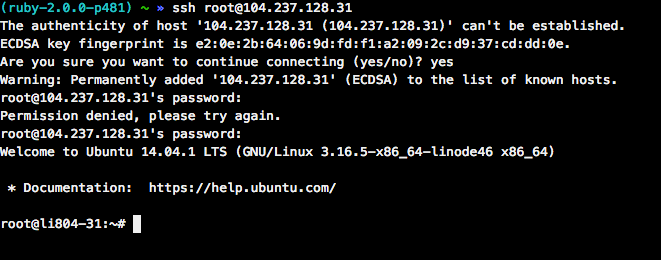

# Lab 12
* Points 10

## Assignment

### Disclaimer
Not everything in this tutorial is fully secure given time constraints of in class. Please use the following tutorial at your own risk, it comes with no warranty or support of any kind.

### Getting setup

Your instructor will provide you with an SSH string, We'll copy the SSH comand and paste it into the c9.io terminal as seen in the following figure:



Now that we are SSHed into our VM let's make sure all the base packages are up to date.

```
$ apt-get update
$ apt-get upgrade
```

### Creating a deploy user
To make managing administrative access our VM let's create a group, 'wheel', that will contain users with sudo privileges.

```
/usr/sbin/groupadd wheel
```

Next we'll use the ```visudo``` command to add the wheel group to the sudoers list.

```
/usr/sbin/visudo
```

With the sudoers file open we'll add the following lines to it:

```
## Allows people in group wheel to run all commands
%wheel  ALL=(ALL)       ALL
```

Then use ctrl-o to save the file followed by ctrl-x to exit the nano editor. With that file saved we can add our deploy user with the following command, and answer all the questions it prompts us for.

```
/usr/sbin/adduser deploy
```

Next we'll add our deploy user to the wheel group.
```
/usr/sbin/usermod -a -G wheel deploy
```
Once we have the deploy user added to the group, we need to make one modification to the ssh server before we can login as the deploy user.

We'll edit the `sshd_config` file and allow passwords to be used then after we add our key to the deploy user we'll turn it back off

Time for a quick overview of vim.  It's very useful because almost every linux server out there already has it installed.

```
vim /etc/ssh/sshd_config
```

Find the line about password authentication and change it to 'yes'. Navigate with the letter `j` or the down arrow until you find the line then move over with `shif+a` then use the delete (backspace) key to delete `no` then type `yes`

```
# Change to no to disable tunnelled clear text passwords
PasswordAuthentication yes
```

Now use `:wq` to write the file and quit vim and then restart the service:

```
$ service sshd restart
```


Then we can logout and login as the deploy user.

```
$ ssh deploy@<your servers ip>
```

### SSH Keys
#### On our VPS

We'll start out on our VPS and generate a key out there with the following command, and copy it so we can add it to Github.

```
$ ssh-keygen -t rsa -C "admin@myserver.com"
$ cat .ssh/id_rsa.pub
```

With our SSH key created we need to add it to our GitHub or Bitbucket account so the server can clone our repository.

#### On our development machine
Next we'll want to upload our development machine ssh key so we don't need to keep typing the following command (if you are on linux or OS X which you'll need to `brew install ssh-copy-id`):

```
$ ssh-copy-id -i ~/.ssh/id_rsa.pub deploy@<your servers ip>
```

Once you have uploaded your key and verified it works we can go back and edit the `sshd_config` file again. This time we'll use `sudo` because we're logged in as `deploy`

```
$ sudo vim /etc/ssh/sshd_config
```

Find the line about password authentication and change it to 'no'. Navigate with the letter `j` or the down arrow until you find the line then move over with `shif+a` then use the delete (backspace) key to delete `yes` then type `no`

```
# Change to no to disable tunnelled clear text passwords
PasswordAuthentication yes
```

* If you want more security you can disable root login. These servers are going to be destroyed soon and don't have access to any other systems. We're going to skip this step.

Now use `:wq` to write the file and quit vim and then restart the service:

```
$ sudo service sshd restart
```

### Installing software

```
$ sudo apt-get -y install curl git-core build-essential zlib1g-dev libssl-dev libreadline-gplv2-dev libcurl4-openssl-dev sqlite3 nodejs npm sendmail vim libsqlite3-dev
```

####Rbenv

Let's install Rbenv to manage our Rubies.

```
$ curl https://raw.githubusercontent.com/fesplugas/rbenv-installer/master/bin/rbenv-installer | bash
```


```
$ vim ~/.bashrc
```

Then we'll add our content at the bottom of the file, press `shift+gg` to move to the bottom of the file then the letter `o` to drop into insert mode. Paste your content:

```
export RBENV_ROOT="${HOME}/.rbenv"

if [ -d "${RBENV_ROOT}" ]; then
  export PATH="${RBENV_ROOT}/bin:${PATH}"
  eval "$(rbenv init -)"
fi
```

Now use `:wq` to write the file and quit vim. Then we'll reload the `.bashrc` file so our shell knows about the changes. You could also logout and back in, but who has time for that!

```
$ source ~/.bashrc
```

**Note:** install whatever version of Ruby the application you want to deploy is. You can find what version of Ruby you are running by using `ruby -v`

```
$ rbenv install --verbose 2.3.0
$ rbenv global 2.3.0
```

#### MySQL
Installing mysql:

```
$ sudo debconf-set-selections <<< 'mysql-server mysql-server/root_password password root'
$ sudo debconf-set-selections <<< 'mysql-server mysql-server/root_password_again password root'
$ sudo apt-get -y install mysql-server mysql-client libmysqlclient-dev
```

I chose for this demo a username: root and password: root.  After your server is setup, create a database for your applicaiton.

```
$ mysql -u root -proot
mysql > create database <application>_production;
```


#### Passenger and Nginx
```
$ gem install passenger bundler
$ rbenv rehash
```

We need swap for Passenger

```
$ sudo dd if=/dev/zero of=/swap bs=1M count=1024
$ sudo mkswap /swap
$ sudo chmod -R 0600 /swap
$ sudo swapon /swap
```


```
$ sudo /home/deploy/.rbenv/shims/passenger-install-nginx-module
```


```
$ wget -O init-deb.sh https://www.linode.com/docs/assets/660-init-deb.sh
$ sudo mv init-deb.sh /etc/init.d/nginx
$ sudo chown root:root /etc/init.d/nginx
$ sudo chmod +x /etc/init.d/nginx
$ sudo /usr/sbin/update-rc.d -f nginx defaults
```

```
$ sudo vim /opt/nginx/conf/nginx.conf
```

inside of the `http` block add:

```
client_body_in_file_only clean;
client_body_buffer_size 32K;

client_max_body_size 300M;
```

Then replace the server block with the following code

```
server {
    listen       *:80;

    root /var/www/<application name>/current/public;
    passenger_enabled on;

    error_page   500 502 503 504  /50x.html;
    location = /50x.html {
        root   html;
    }

}
```

```
$ sudo mkdir -p /var/www
$ sudo chown deploy /var/www/
```

Then restart nginx for things to take effect:

```
$ sudo service nginx restart
```

### Setting up our app

```
gem 'capistrano-rails'
gem 'capistrano-bundler'
gem 'capistrano-rbenv', '~> 2.0', require: false

group :production do
  gem 'mysql2', '~> 0.3.13'
end
```

And remove the Postgres gem if you are following along with this tutorial and the book application.

```
$ bundle install --without production
```

```
$ bundle exec cap install
```
Add the following to your config/deploy/production.rb
```
server '<your server ip>', user: 'deploy', roles: %w{web app db}

set :ssh_options, {
    keys: %w(/home/action/.ssh/id_rsa),
    forward_agent: true,
    user: 'deploy'
  }
```

Then change your config/deploy.rb to the following:

```
lock "3.8.1"

set :application, 'your_application_name'
set :repo_url, 'git@bitbucket.org:username/your_git_url'
set :rbenv_type, :user
set :rbenv_ruby, '2.3.0'
set :rbenv_prefix, "RBENV_ROOT=#{fetch(:rbenv_path)} RBENV_VERSION=#{fetch(:rbenv_ruby)} #{fetch(:rbenv_path)}/bin/rbenv exec"
set :rbenv_map_bins, %w{rake gem bundle ruby rails}
set :rbenv_roles, :all # default value

# Default branch is :master
ask :branch, proc { `git rev-parse --abbrev-ref HEAD`.chomp }.call

# Default deploy_to directory is /var/www/my_app
set :deploy_to, "/var/www/#{fetch(:application)}"

# Default value for :pty is false
set :pty, true

# Default value for :linked_files is []
set :linked_files, %w{config/database.yml config/application.yml config/secrets.yml}

namespace :deploy do

  desc 'Restart application'
  task :restart do
    on roles(:app), in: :sequence, wait: 5 do
       execute :touch, release_path.join('tmp/restart.txt')
    end
  end

  after :publishing, :restart

end
```

Then modify the capfile in the root of your application to look like the following:

```
# Load DSL and Setup Up Stages
require 'capistrano/setup'

require 'capistrano/deploy'
require 'capistrano/rbenv'
require 'capistrano/bundler'
require 'capistrano/rails/assets'
require 'capistrano/rails/migrations'

require "capistrano/scm/git"
install_plugin Capistrano::SCM::Git


# Loads custom tasks from 'lib/capistrano/tasks' if you have any defined.
Dir.glob('lib/capistrano/tasks/*.rake').each { |r| import r }
```

We'll need to configure assets to be compiled, in our config/environments/production.rb
default is set to false, we'll change it to true
```
  config.assets.compile = true
```

```
$ bundle exec cap production deploy:check
```

We'll need to create a database.yml file in var/www/\<your app name>/shared/config with the correct values for your application.

```
production:
  adapter: mysql2
  database: <application>_production
  host: localhost
  username: root
  password: root
```

We'll need to create an application.yml file in var/www/\<your app name>/shared/config with the correct values for your application.

```
#Weather is an example from class
weather_api: adsfasdfdsaf
```

We'll also need to create a secrets.yml to overwrite our checked in one, so we keep that key seperate from our application code.

```
production:
  secret_key_base: 5a7e2c9828947445d258e8083d87896df018c759d65e43e4799e456a52d5360c554c6a9af6f691cad8854352fa5e8ec9885b5a6c2405cfef864df5e8f3976b48
```


We'll need to commit some of our code

Now we should be able to deploy our site.
```
$ bundle exec cap production deploy deploy:migrate
```

If you get an error about bundler try reinstalling the bundler gem on your server.

###Notes:
* If you are sending emails, make sure that you configure the host in your production.rb file to have a config action mailer default url.
